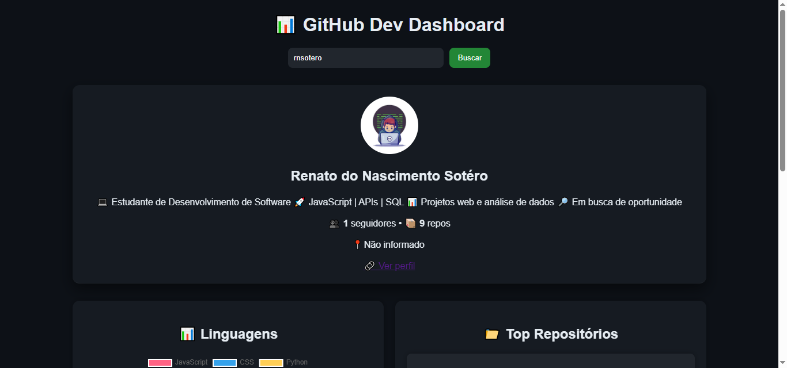
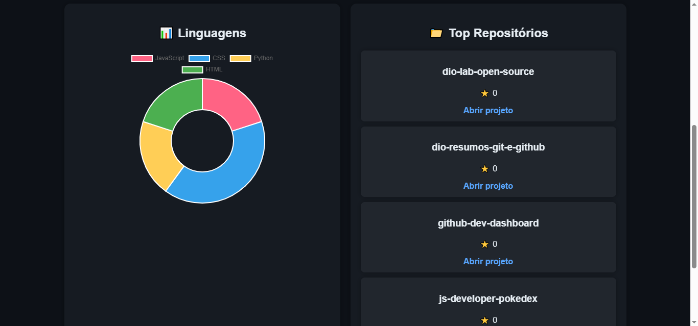

# 📊 GitHub Dev Dashboard

[](https://rnsotero.github.io/github-dev-dashboard)


Aplicação web que consome a API do GitHub para visualizar perfis, repositórios e estatísticas de forma interativa e moderna.

Este projeto foi desenvolvido com o objetivo de **praticar JavaScript, consumo de APIs REST e manipulação do DOM**, além de criar uma interface moderna em **Dark Mode**.

---

## 🚀 Funcionalidades

- 🔍 Busca de usuários do GitHub
- 👤 Exibição de perfil (avatar, bio, seguidores, localização)
- 📁 Top repositórios mais populares
- 📊 Gráfico de linguagens com Chart.js
- 💾 Salvamento da última busca (localStorage)
- ⚡ Skeleton loading (UX moderna)
- ❌ Tratamento de erros (usuário não encontrado)

## 🛠️ Tecnologias utilizadas

- HTML5
- CSS3
- JavaScript (Vanilla)
- Chart.js
- AOS (animações)
- GitHub REST API

---

## 📷 Preview


---

### 📊 Dashboard



### 📈 Gráfico de Linguagens



---

## ⚙️ Como executar o projeto

1. Clone o repositório

```
git clone https://github.com/rnsotero/github-dev-dashboard.git
```

2. Acesse a pasta do projeto

```
cd github-dev-dashboard
```

3. Abra o arquivo `index.html` no navegador

---

## 🎯 Objetivo do Projeto

Este projeto foi criado como parte do meu processo de aprendizado em **desenvolvimento web**, com foco em:

* consumo de **APIs REST**
* manipulação de **dados em JavaScript**
* criação de **interfaces interativas**
* organização de projetos para portfólio

---

## 📚 Aprendizados

Durante o desenvolvimento, evoluí minhas habilidades em:

* consumir APIs utilizando **Fetch API**
* manipular dados retornados em **JSON**
* criar gráficos dinâmicos com **Chart.js**
* trabalhar com **eventos e DOM em JavaScript**
* estruturar um projeto para portfólio no GitHub

---

## 📌 Melhorias futuras

- Melhorar responsividade (mobile-first)
- Implementar modo Light/Dark
- Paginação de repositórios
- Filtros por linguagem
- Deploy com CI/CD

---

## 🤝 Contribuições

Contribuições são bem-vindas!
Sinta-se à vontade para abrir **issues** ou enviar **pull requests**.

---

## 📄 Licença

Este projeto está sob a licença MIT.


## 👨‍💻 Autor

Desenvolvido por Renato Sotero

🔗 https://www.linkedin.com/in/renato-sotero-028b9a1b0/


💡 Projeto com foco em evolução contínua e boas práticas de front-end.
